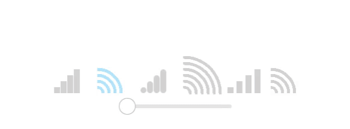

# signalindicator
Signal strength indicator for Qt Quick

## ScreenShots:


## Add to project:
Add `src/signal_indicator.pri` to your `.pro` file:

`include(path/to/src/signal_indicator.pri)`

Add `engine.addImportPath("qrc:/");` to the `main.cpp`

And then import `SignalIndicator` into your `qml` file:

`import SignalIndicator 1.0`

## Usage:
a simple usage of SignalIndicator can be look like the following:
```
SignalIndicator
{
    value: 50
    from: 0
    to: 100
    width: 50
    height: 100
}
```
Also you can change indicator by changing `SignalIndicator` `contentItem`:

```
SignalIndicator
{
    value: 50
    from: 0
    to: 100
    indicatorCount: 6
    contentItem: ArcIndicator {
        turnOnColor: "purple"
        capStyle: ShapePath.RoundCap
        animation: false
    }
}
```
## Ready to use Indicators:

* BarIndicator
* ArcIndicator

## Contribution:
Please help me to improve the quality of the project, contributions are welcome! :)